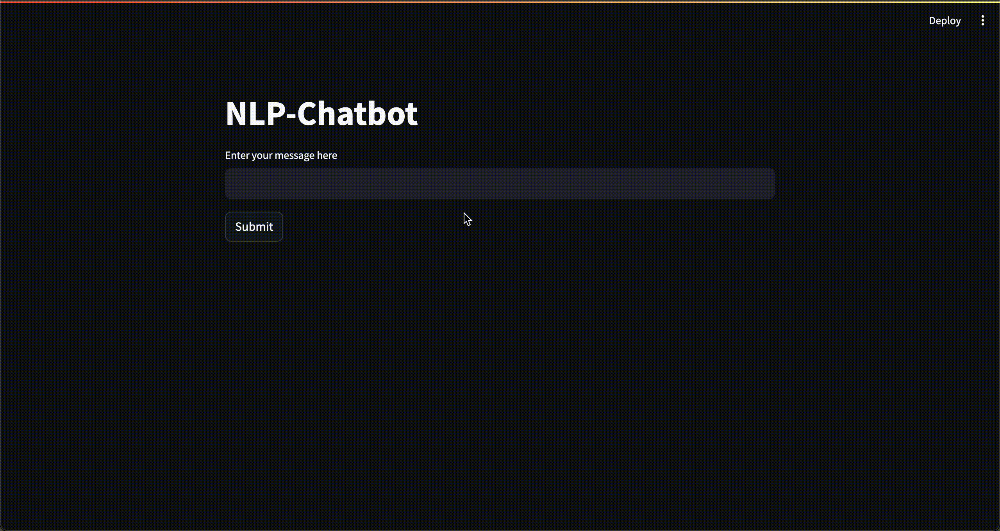

## Demo

## Explanation Video
The explanation video can be found [Here](videolink)

## NLP Chatbot Setup Details

### Chatbot Development Strategies

When creating an NLP chatbot, I have various strategies at my disposal:

- **Rule-based Approach**: This method involves establishing predefined rules and patterns to govern the chatbot's responses. While simple, it may struggle with handling complex queries effectively.

- **Pretrained Model Utilization**: Leveraging pretrained models like DialoGPT from Hugging Face offers a quick deployment solution with minimal training. Fine-tuning these models for specific domains can significantly enhance their performance.

- **Custom Model Training**: Training a custom model using frameworks like PyTorch or TensorFlow provides the flexibility to precisely tailor the chatbot's responses. However, it demands substantial time and resources for data collection, training, and evaluation.

### Preferred Approach

Given the task of developing a chatbot to tackle science-related inquiries, I opted for a hybrid approach.

- **Fine-tuned Pretrained Model**: I chose to fine-tune a DialoGPT model on science-related data to ensure contextually relevant responses. This involves training the pretrained DialoGPT model on a custom dataset specifically curated for science-related queries. By fine-tuning the model, I adapt it to understand and generate responses tailored to scientific topics, ensuring accuracy and relevance in its interactions.

### Execute Function Overview

The `execute` function in `main.py` acts as the chatbot's core component. It analyzes user input, applies relevant rules or models, and generates appropriate responses. This function undergoes continuous refinement to enhance the chatbot's performance and accuracy.

### Development Guidelines

Throughout the development process, I adhere to the following guidelines:

- 👎 Avoid External Services: I steer clear of relying on external services like chatGPT to maintain autonomy and control over the chatbot's functionality.

- 👎 Originality is Key: I prioritize originality and innovation, ensuring that my solutions stand out in the field.

- 👎 Reliability is Non-negotiable: I prioritize the reliability and robustness of my chatbot, aiming to deliver a seamless user experience without any critical failures.

### Training and Data Insights

My training process involves fine-tuning the DialoGPT model using a custom dataset crafted specifically for science-related inquiries. This dataset, stored in the `/NOTEBOOKS` directory, encompasses a diverse range of conversational scenarios, ensuring the model's adaptability and effectiveness.

Following rigorous training and validation, the fine-tuned model is stored in the `/MODELS` directory, ready for deployment. Additionally, the original data used for training and validation purposes is archived in the `/DATA` directory, facilitating transparency and reproducibility.

Upon completion of the fine-tuning process, comprehensive insights and performance metrics are documented in the `/RESULTS` directory, guiding further optimization and refinement efforts.

## Initiating the Chatbot Application

To launch the chatbot locally, execute the `script.sh` file. Additionally, the Streamlit user interface can be accessed by running `streamlit run app.py`.
